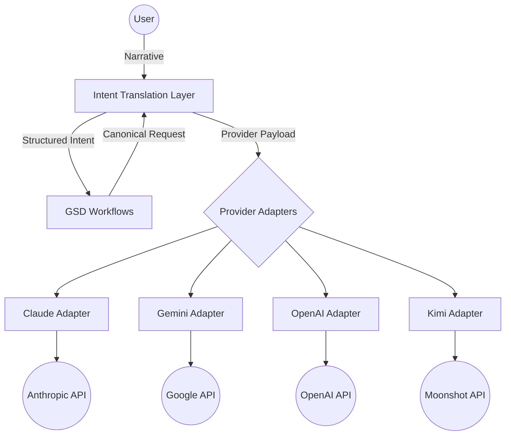

# ARCHITECTURE: Intent Translation Layer & Multi-Provider Support

## Overview
The Intent Translation Layer (ITL) acts as a provider-agnostic intermediary between `get-stuff-done` workflows and various LLM providers (Claude, Kimi, Gemini, OpenAI). It ensures that user narrative is consistently translated into structured intent without modifying the core behavior of GSD agents.

## Component Architecture

### 1. ITL Core (Node.js/TypeScript)
- **Narrative Parser:** Extracts structured intent (goals, constraints, etc.) from freeform text.
- **Canonical Schema:** Defines standard objects (using Zod) for communication between GSD and providers.
- **Ambiguity Engine:** Detects conflicting or vague requirements and manages human escalation.
- **Audit Logger:** Persists explicit vs. inferred intent to a local SQLite database for transparency.

### 2. Provider Adapters (Adapter Pattern)
- **Payload Mapping:** Translates canonical GSD requests into provider-specific API formats (e.g., `messages` vs. `content` blocks).
- **Response Parsing:** Normalizes provider-specific outputs back into canonical GSD structures.
- **Prompt Registry:** Manages optimized prompt templates tailored to each provider's strengths and behaviors.

### 3. Hook System Integration (bin/install.js)
- **Standardized Event Handlers:** Injects event handlers into Claude's `settings.json` hooks (`BeforeTool`, `AfterTool`, etc.).
- **Decoupled Injection Logic:** Ensures that hook installation doesn't corrupt the system and remains compatible with other runtimes.
- **Universal Triggering:** Allows non-Claude providers to trigger the same middleware logic through a unified interface.

## Patterns & Principles
- **Preserve Agent Behavior:** Enhancements must focus on the user interaction layer, not change how GSD agents inherently function.
- **Canonical over Provider-Specific:** Always use standardized internal schemas to avoid tight coupling with any single LLM.
- **Escalation on Ambiguity:** If intent extraction confidence is low, trigger a human-friendly clarification flow.
- **100% Coverage:** Every component of the ITL and its adapters must be covered by unit and integration tests.

## Security & Transparency
- **Audit Trail:** Every inferred decision must be documented in the project state.
- **Secret Protection:** Provider-specific API keys must be handled through environment variables, never committed.

---
*Last updated: 2026-03-16*
