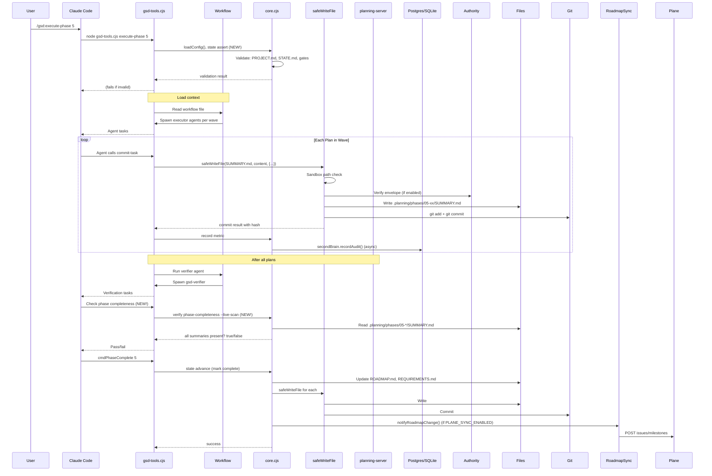

# GSD Architecture (v0.4.0 - Current State)

**Warning:** The original `docs/ARCHITECTURE.md` (last updated 2025-01-24) describes an outdated 5-layer design with 11 CLI modules and no external dependencies. **This document reflects the actual current architecture** as of 2026-03-25 (v0.4.0 development).

---

## System Overview

GSD has evolved from a simple file-based meta-prompting framework into a **hybrid orchestration system** with:

- **40+ Node.js CLI modules** (organized by concern)
- **Embedded HTTP server** (Planning Server) for cross-agent context isolation
- **PostgreSQL + RabbitMQ** for knowledge graph and message queue (optional but primary)
- **SQLite** for audit logging (fallback)
- **External service integrations**: Plane (project management), Firecrawl (context control)
- **Cryptographic authority** system for file operation guarantees
- **AST parsing** via Tree-Sitter for code analysis
- **Provider abstraction** layer supporting Claude, Gemini, Kimi, OpenAI

The system maintains **file-based state** as source-of-truth (`.planning/`) but adds runtime services to enforce guarantees and provide observability.

---

## High-Level Architecture

```mermaid
graph TB
    subgraph "User Interface"
        CLI[Claude Code / Gemini CLI / Codex]
    end

    subgraph "GSD Harness"
        Commands[Commands<br/>commands/gsd/*.md]
        Workflows[Workflows<br/>get-stuff-done/workflows/*.md]
        Agents[Agents<br/>agents/*.md]
        CLI_Tools[CLI Tools<br/>get-stuff-done/bin/]
        Refs[References<br/>get-stuff-done/references/]
        Templates[Templates<br/>get-stuff-done/templates/]
    end

    subgraph "Enforcement Layer"
        Core[core.cjs<br/>Safe operations]
        SafeWrite[safeWriteFile<br/>+ authority + sandbox]
        Gates[gate.cjs<br/>Human checkpoints]
        Verify[verify.cjs<br/>Validation suite]
        State[state.cjs<br/>STATE.md management]
    end

    subgraph "Services"
        Planning Server[planning-server.cjs<br/>HTTP read proxy]
        Second Brain[second-brain.cjs<br/>Knowledge graph]
        Broker[broker.cjs<br/>RabbitMQ interface]
    end

    subgraph "Storage"
        Files[.planning/ files<br/>Source of truth]
        Postgres[(PostgreSQL<br/>optional primary)]
        SQLite[(SQLite audit<br/>fallback)]
    end

    subgraph "External Integrations"
        Firecrawl[Firecrawl API<br/>Context control]
        Plane[Plane API<br/>Project sync]
    end

    Commands --> Workflows
    Workflows --> Agents
    Workflows --> CLI_Tools
    Workflows --> Refs
    Agents -.-> CLI_Tools

    CLI_Tools --> Core
    Core --> SafeWrite
    Core --> Gates
    Core --> Verify
    Core --> State

    CLI_Tools --> Planning Server
    CLI_Tools --> Second Brain
    Second Brain --> Postgres
    Second Brain --> SQLite
    Second Brain --> Broker
    Broker --> RabbitMQ[(RabbitMQ)]

    SafeWrite --> Files
    Verify --> Files
    State --> Files

    CLI_Tools --> Firecrawl
    CLI_Tools --> Plane

    style Files fill:#e1f5fe
    style Postgres fill:#f3e5f5
    style Planning Server fill:#fff3e0
    style Second Brain fill:#e8f5e8
```

---

## Component Catalog (40 CLI Modules)

### Core Infrastructure

| Module | Lines | Responsibility | Dependencies |
|--------|-------|----------------|--------------|
| `core.cjs` | ~1500 | Error handling, output, safeFs, safeGit, findPhaseInternal, utilities | fs, path, child_process |
| `config.cjs` | ~400 | config.json read/write, section initialization | fs, path |
| `state.cjs` | ~1200 | STATE.md parsing, updating, advancing, metrics recording | core, frontmatter |
| `phase.cjs` | ~1000 | Phase directory ops, completion, numbering, milestone filtering | core, state, roadmap |
| `roadmap.cjs` | ~900 | ROADMAP.md parsing, phase extraction, update-plan-progress, sync hooks | core, safeFs |
| `verify.cjs` | ~2000 | Multi-subcommand validation: plan-structure, phase-completeness, references, commits, artifacts, integrity, health | core, state, frontmatter, artifact-schema |

### ITL (Intent Translation Layer)

| Module | Lines | Responsibility |
|--------|-------|----------------|
| `itl.cjs` | ~300 | Coordinator, main entry point |
| `itl-schema.cjs` | ~500 | Zod schemas for canonical contracts |
| `itl-adapters.cjs` | ~400 | Provider adapter registry (Claude, Gemini, Kimi, OpenAI, internal) |
| `itl-extract.cjs` | ~300 | Heuristic narrative extraction (fallback) |
| `itl-ambiguity.cjs` | ~600 | Ambiguity detection with adversarial checks |
| `itl-audit.cjs` | ~300 | SQLite audit logging |
| `itl-summary.cjs` | ~200 | User-facing summary rendering |
| `artifact-schema.cjs` | ~400 | Checkpoint and summary Zod schemas |

### Context & Storage

| Module | Lines | Responsibility |
|--------|-------|----------------|
| `context.cjs` | ~500 | Context management, enrichment pipelines |
| `context-store.cjs` | ~400 | File-backed artifact storage with deterministic IDs |
| `context-schema.cjs` | ~300 | ContextArtifact Zod schema |
| `context-artifact.cjs` | ~200 | Artifact model and utilities |

### AST & Normalization

| Module | Lines | Responsibility |
|--------|-------|----------------|
| `ast-parser.cjs` | ~400 | Tree-Sitter wrapper with synchronous regex fallback |
| `internal-normalizer.cjs` | ~350 | Transform internal planning files into ContextArtifacts |
| `firecrawl-normalizer.cjs` | ~300 | Transform external docs via Firecrawl into ContextArtifacts |
| `schema-registry.cjs` | ~150 | Registry for artifact schemas |

### Authority & Policy

| Module | Lines | Responsibility |
|--------|-------|----------------|
| `authority.cjs` | ~500 | Envelope signing/verification for writes |
| `policy.cjs` | ~400 | Policy decision point (allow/deny) |
| `openbox-policy.cjs` | ~200 | Default permissive policy (used in dev) |

### Second Brain (Knowledge Graph)

| Module | Lines | Responsibility |
|--------|-------|----------------|
| `second-brain.cjs` | ~600 | Graph interface: write nodes/edges, query, audit |
| `brain-manager.cjs` | ~400 | Lifecycle: init, start, stop, health checks |
| `policy-grant-cache.cjs` | ~200 | Cache policy grants for performance |
| `audit.cjs` | ~300 | Audit logging to SQLite with project tagging |

### Firecrawl Integration

| Module | Lines | Responsibility |
|--------|-------|----------------|
| `firecrawl-client.cjs` | ~400 | HTTP client with retry, rate limiting |
| `firecrawl-normalizer.cjs` | ~300 | Data transformation (moved above) |
| `searxng-client.cjs` | ~300 | Search provider client (if used) |

### Planning Server

| Module | Lines | Responsibility |
|--------|-------|----------------|
| `planning-server.cjs` | ~600 | Express-like HTTP server (GET /v1/read, POST /v1/extract) |
| `audit.cjs` | ~300 | Server audit logging (separate from second-brain) |

### Plane Integration

| Module | Lines | Responsibility |
|--------|-------|----------------|
| `plane-client.cjs` | ~350 | HTTP client for Plane API (milestones, issues) |
| `roadmap-plane-sync.cjs` | ~380 | Sync orchestration with idempotent upsert, drift detection |
| `roadmap.cjs` (modified) | ~900 | Added `cmdRoadmapSync` and `notifyRoadmapChange` hook |

### Observability & User Profiling

| Module | Lines | Responsibility |
|--------|-------|----------------|
| `next-step.cjs` | ~200 | Progress tracking for `gsd:progress` |
| `profile-pipeline.cjs` | ~400 | Extract user behavior patterns |
| `profile-output.cjs` | ~200 | Render profile data |

### Infrastructural

| Module | Lines | Responsibility |
|--------|-------|----------------|
| `sandbox.cjs` | ~300 | Path guards, shell command interception |
| `milestone.cjs` | ~250 | Milestone archival, requirements marking |
| `gate.cjs` | ~400 | Gate state: enforce, release, check, list |
| `gate.cjs` | - | (Note: may be duplicate entry) |
| `broker.cjs` | ~150 | RabbitMQ connection management |
| `artifact-schema.cjs` | ~400 | (duplicate entry above) |
| `frontmatter.cjs` | ~350 | YAML frontmatter CRUD |
| `template.cjs` | ~400 | Template selection and filling |
| `init.cjs` | ~500 | Compound context loading for workflows |
| `commands.cjs` | ~600 | Command routing, task commits, checkpoint writes, scaffolds |
| `model-profiles.cjs` | ~200 | Model profile resolution table |

### ITL Summary (Standalone Package)

The `packages/itl/` directory contains a standalone package with API:
- `interpret_narrative(input_text, context_data)` - main entry
- `build_provider_request()` - provider payload construction
- `get_supported_providers()` - provider enumeration
- Zod schemas

** dissonance:** The internal `get-stuff-done/bin/lib/itl-*.cjs` modules still exist and provide more functionality (adapters, audit, summary). The package is a subset.

---

## Data Flow: Normal Phase Execution



---

## Key Design Decisions (Missing ADRs)

The following architectural decisions were made without formal ADR records:

### 1. Why Postgres and RabbitMQ?

**Decision:** Use Postgres as primary storage for knowledge graph, with SQLite fallback. RabbitMQ for message queue.

**Rationale (inferred):**
- File-based storage became insufficient for graph queries and concurrent access
- Second Brain needs transactional guarantees and complex queries
- RabbitMQ provides reliable event streaming for audit trail

**Trade-off:** Added operational complexity (requires external services) vs. file-only simplicity.

### 2. Why Planning Server?

**Decision:** Introduce embedded HTTP server (`planning-server.cjs`) as exclusive read path for agents.

**Rationale:**
- Enforce authority verification on reads (previously only writes)
- Provide a single choke point for cross-agent context sharing
- Enable audit logging of all context access

**Trade-off:** Additional process to manage, but gains centralized control.

### 3. Why Authority System?

**Decision:** Cryptographic envelope signing for all writes to `.planning/` via `safeWriteFile`.

**Rationale:**
- Ensure no write bypasses the enforcement boundary
- Detect tampering or agent misbehavior
- Provide non-repudiation

**Trade-off:** Key management overhead, performance cost (sign/verify).

### 4. Why Firecrawl as Control Plane?

**Decision:** Transform Firecrawl from simple crawler into centralized context gate.

**Rationale:**
- All external data should flow through a single validated entry point
- Mirror StrongDM's visibility model for internal context
- Enable audit of what external content entered the system

**Trade-off:** Tighter coupling to Firecrawl; must maintain control plane features.

### 5. Why Plane Integration?

**Decision:** Bidirectional sync with Plane for project visibility.

**Rationale:**
- Users want to see GSD work in their existing PM tools
- Plane's issue hierarchy maps well to milestones/phases/plans
- Provides external tracking outside of Claude sessions

**Trade-off:** Data model drift potential; sync conflicts.

---

## Current Layering (Reality vs. Docs)

### Documented Layers (Outdated)

```
Command Layer (commands/gsd/*.md)
Workflow Layer (workflows/*.md)
Agent Layer (agents/*.md)
CLI Tools Layer (bin/gsd-tools.cjs)
Reference Layer (references/*.md)
```

**Problem:** This ignores the services, enforcement layer, and ITL complexity.

### Actual Layers (2026-03-25)

```
┌─────────────────────────────────────────────────────────────┐
│                     User Interface Layer                     │
│  Claude Code / Gemini CLI / Codex slash commands & agents  │
├─────────────────────────────────────────────────────────────┤
│                   Orchestration Layer                       │
│  Commands → Workflows → Agents → CLI Tools                 │
├─────────────────────────────────────────────────────────────┤
│                 Enforcement & Safety Layer                  │
│  core.cjs, safeWriteFile, gates, verify, state, sandbox    │
├─────────────────────────────────────────────────────────────┤
│                   Service Layer                             │
│  Planning Server, Second Brain, ITL Canonical, Authority    │
├─────────────────────────────────────────────────────────────┤
│                 Storage & Integration Layer                 │
│  .planning/ (files), Postgres, SQLite, Firecrawl, Plane    │
└─────────────────────────────────────────────────────────────┘
```

---

## Cross-Cutting Concerns

### Authority & Enforcement

All writes to `.planning/` **must** go through `safeWriteFile()` which:
1. Checks sandbox (project root containment)
2. Verifies authority envelope signature (if policy requires)
3. Logs audit event to secondBrain
4. Writes file atomically
5. Commits to git with proper message

**Enforcement boundary primitives:**
- Exit 1: `safeWriteFile` failure (sandbox violation, auth failure)
- Exit 1: `gate enforce` (human checkpoint blocking)
- Exit 13: `checkpoint write` (special handling)
- Exit 1: `state assert` (pre-condition failure) ← **ADD in Phase 51**

### Context Determinism

All agent reads **should** go through Planning Server (`/v1/read`) to:
- Enforce authority verification on reads
- Provide consistent view across agents
- Cache frequently accessed artifacts

**Reality:** Not all modules use Planning Server yet. Many still use `safeFs` directly.

### Observability

- Second Brain records all Firecrawl and Plane API calls
- Audit logs in SQLite `audit.cjs` table
- Performance metrics in STATE.md `Performance Metrics` (write-only currently)
- Structured logging via `logDebug`, `logInfo`, `logWarn`, `logError`

---

## Subsystem Deep Dives

### 1. Intent Translation Layer (ITL)

**Purpose:** Translate user narrative into structured intent with ambiguity detection.

**Canonical Schema:**

```javascript
{
  narrative: string,
  interpretation: {
    goals: string[],
    constraints: string[],
    preferences: string[],
    anti_requirements: string[],
    success_criteria: string[],
    risks: string[],
    unknowns: string[],
    assumptions: string[],
    inferences: { text, evidence, confidence, field }[]
  },
  ambiguity: {
    is_ambiguous: boolean,
    severity: 'low' | 'medium' | 'high',
    score: 0-1,
    findings: [{ type, severity, message, evidence }]
  },
  lockability: {
    lockable: boolean,
    status: 'lockable' | 'guidance-only',
    findings: []
  },
  summary: string (markdown),
  provider_request: { provider, ... }  // What to send to LLM API
}
```

**Adapters:** Each provider (Claude, Gemini, Kimi, OpenAI) has an adapter that transforms canonical request → provider-specific format and parses response back to canonical.

**Problem:** The standalone `packages/itl` exports only `interpret_narrative` and subset of schemas. Internal modules have more. Unclear which is source of truth.

### 2. Second Brain & Authority

**Components:**
- `second-brain.cjs`: High-level graph API
- `brain-manager.cjs`: Start/stop/health
- `audit.cjs`: SQLite logger
- `policy.cjs`: Policy decision point
- `authority.cjs`: Cryptographic signing/verification

**Flow for a write via `safeWriteFile`:**
```
safeWriteFile(path, content, opts)
  → sandbox check (path within project root)
  → policy.check('write', path, content)  (may load grants from cache)
  → if policy.requiresAuthority: authority.verifyEnvelope(content)
  → write file
  → secondBrain.recordNode(path, hash, metadata)
  → secondBrain.recordAudit({ action: 'write', ... })
```

**Database schema (Postgres):**
- `nodes` table: path, hash, content (optional), metadata
- `edges` table: from_path, to_path, type
- `project_identity` table: project_id (SHA-256 of root), created_at
- `audit` table: action, url, status, latency_ms, timestamp

**Fallback:** If Postgres unavailable, use SQLite `second-brain.db` (node:sqlite).

### 3. Planning Server

**Purpose:** HTTP server that routes all internal reads through authority checks.

**Endpoints:**
- `GET /v1/read?path=...` - Read arbitrary project file (subject to authority)
- `GET /v1/phase-info?phase=...` - Get phase directory info
- `GET /v1/state` - Get STATE.md
- `GET /v1/config` - Get config (redacted)
- `POST /v1/extract` - Run normalization pipeline (used by Firecrawl)

**Security:**
- Binds to 127.0.0.1 by default (configurable via `GSD_PLANNING_HOST`)
- Optional authentication (Basic or Bearer) if `GSD_PLANNING_AUTH_ENABLED`
- Rate limiting: 60 RPM per client IP (configurable)
- CORS disabled by default, opt-in via `GSD_PLANNING_CORS_ORIGINS`

**Status:** Currently optional; many modules still use `safeFs` directly.

### 4. Firecrawl Control Plane

**Role:** Centralized context intake with audit and normalization.

**Normalization pipeline:**
```
External content (URL, PDF, HTML)
   ↓
Firecrawl crawl API
   ↓
firecrawl-client.cjs fetch
   ↓
firecrawl-normalizer.cjs transform → ContextArtifact
   ↓
context-store.cjs store with deterministic ID
   ↓
.planning/context/artifacts/{hash}.json
```

**Policy:** All external data must come through Firecrawl, not direct `WebSearch` or arbitrary HTTP.

**Audit:** Every crawl recorded in `firecrawl_audit` table with project_id, URL, schema, status, latency.

---

## Deployment Topology

### Single-Project (Most Common)

```
~/.claude/                    Global GSD installation
├── commands/gsd/*.md        40+ slash commands
├── agents/*.md              15 agent definitions
├── get-stuff-done/          Core library
│   ├── bin/gsd-tools.cjs
│   ├── bin/lib/             40 modules
│   ├── workflows/
│   ├── references/
│   └── templates/
└── hooks/                   Event handlers

project/.planning/           Project-specific state
├── PROJECT.md
├── ROADMAP.md
├── STATE.md
├── phases/
├── context/artifacts/
└── config.json
```

Process: Single Node.js process (Claude Code) loads GSD commands, spawns subagents as needed.

### Multi-Project with Services

```
Project A/                    Project B/
├── .planning/                ├── .planning/
│   └── config.json          │   └── config.json
└── (work files)             └── (work files)

Postgres: gsd_local_brain_<hashA>, gsd_local_brain_<hashB>
SQLite: per-project or shared with project_id tag
Planning Server: 127.0.0.1:3001 (shared, project_id from context)
RabbitMQ: localhost exchanges prefixed with project_id
```

**Isolation:**
- Database names include project hash suffix
- Planning Server uses `fs.realpathSync` to enforce root containment
- Audit records tagged with `project_id`
- Message queues use project-specific routing keys

---

## Configuration

**Location:** `.planning/config.json`

**Schema (partial):**
```json
{
  "planning": {
    "commit_docs": true,
    "search_gitignored": false
  },
  "workflow": {
    "auto_advance": false,
    "interactive": true
  },
  "plan_checker": {
    "enabled": true,
    "max_iterations": 3
  },
  "researcher": {
    "enabled": true,
    "parallel": 4
  },
  "verifier": {
    "enabled": true
  },
  // Missing but written: mode, granularity, adversarial_test_harness
}
```

**Environment variables:**
- `GSD_PLANNING_HOST` - Planning Server host:port
- `GSD_PLANNING_AUTH_ENABLED`, `GSD_PLANNING_AUTH_SECRET` - Server auth
- `PLANE_API_KEY`, `PLANE_PROJECT_ID` - Plane integration
- `PLANE_SYNC_ENABLED` - Toggle Plane sync (default: enabled)
- `POSTGRES_URL` or `GSD_DB_NAME` - Database connection
- `RABBITMQ_URL` - Message broker
- `GSD_PAUSED` - Set by `pause-work` (checker should respect)

---

## Known Drift & Inconsistencies

### 1. Dual ITL Modules

Both exist:
- `packages/itl/` (standalone package, exports `interpret_narrative`)
- `get-stuff-done/bin/lib/itl-*.cjs` (internal full suite)

**Which to use?** Workflows use internal. Package may be used by external consumers. They should be kept in sync but aren't automatically.

### 2. Unused Config Keys

- `mode`, `granularity` written by `new-project.md` but never read by `loadConfig()`
- `adversarial_test_harness` in VALID_CONFIG_KEYS but no implementation reads it

### 3. Checkpoint Schema Fragmentation

Two schemas:
- `itl-ambiguity.cjs` → `clarificationCheckpointSchema` (discuss-phase)
- `artifact-schema.cjs` → `checkpointResponseSchema` (agent return)

No shared base type. They should be unified.

### 4. Missing Verification

- `verify phase-completeness` exists but **not called** in `execute-phase` before `verify_phase_goal`
- `verify research-contract` exists but only called when `ADVERSARIAL_TEST_HARNESS_ENABLED=true` in `plan-phase`

### 5. Write-Only Metrics

`cmdStateRecordMetric` writes to STATE.md `Performance Metrics` table, but no parser exists to read them back.

### 6. Duplicate Function

`stateExtractField` defined twice in `state.cjs` (line 12 and 184). One is dead code.

---

## Testing Strategy

**Coverage gates:**
- 100% line coverage for `get-stuff-done/bin/lib/itl*.cjs` and `packages/itl/**/*.cjs`
- Not currently enforced for other modules

**Test types:**
- Unit tests: per module with stubs (most files)
- Integration tests: end-to-end workflow tests (e.g., `workflow-scenario.test.cjs`)
- Compliance tests: `verify-workflow-readiness.test.cjs` checks workflow structure

**Gaps:** Enforcement boundary violations (bypassing safeWriteFile) not tested.

---

## Migration Path for v0.5.0

1. **Document the actual architecture** (this doc + ADRs)
2. **Close P0 enforcement gaps** (Phase 51)
3. **Decide on ITL package strategy** (unify or keep both with clear boundaries)
4. **Unify checkpoint schemas**
5. **Implement Planning Server as mandatory** (deprecate direct safeFs reads)
6. **Add comprehensive observability** (metrics collection, dashboards)
7. **Create operational runbooks** for service dependencies (Postgres, RabbitMQ)

---

## References

- `.planning/audit/ARCHITECTURAL-DRIFT-ASSESSMENT-2026-03-25.md` - Gap analysis
- `.planning/audit/PLANE-INTEGRATION-ENFORCEMENT-REVIEW-2026-03-25.md` - Plane review
- `.planning/audit/arch-enforcement.md` - Enforcement gaps (older)
- `.planning/audit/concerns-debt.md` - Technical debt inventory
- Original (stale): `docs/ARCHITECTURE.md`, `.planning/codebase/ARCHITECTURE.md`

---

**Document maintained by:** GSD team
**Last updated:** 2026-03-25
**Next review:** After Phase 51 completion
